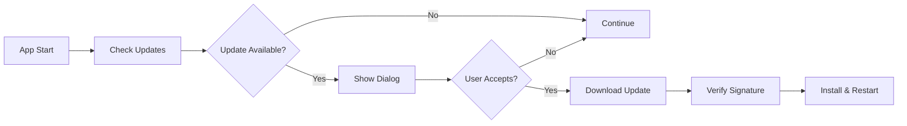

# ValeChat Distribution Guide

This document outlines the complete distribution and release infrastructure for ValeChat.

## Overview

ValeChat uses a comprehensive CI/CD pipeline built with GitHub Actions to:
- Build applications for all supported platforms
- Sign and notarize binaries for security
- Generate packages in multiple formats
- Distribute through various channels
- Provide automatic updates to users

## Supported Platforms & Formats

### Linux
- **AppImage**: Universal Linux binary (recommended)
- **DEB**: Debian/Ubuntu packages
- **RPM**: Red Hat/Fedora packages
- **Tar.gz**: Generic Linux archive

### macOS
- **DMG**: macOS disk image installer (recommended)
- **App Bundle**: Standalone .app package
- **Universal Binary**: Supports both Intel and Apple Silicon

### Windows
- **MSI**: Windows Installer package (recommended)
- **NSIS**: Nullsoft installer executable
- **Portable**: Standalone executable

## Build Pipeline

### Automated Builds

The CI/CD pipeline (`/.github/workflows/ci.yml`) automatically:

1. **Tests**: Run comprehensive test suite across platforms
2. **Security**: Perform security audits and license checks
3. **Build**: Cross-compile for all target platforms
4. **Sign**: Code sign binaries with platform certificates
5. **Package**: Generate distribution packages
6. **Release**: Upload to GitHub releases
7. **Update**: Publish update manifests

### Manual Releases

Use the release workflow (`/.github/workflows/release.yml`):

```bash
# Trigger via GitHub UI or:
gh workflow run release.yml -f release_type=minor
```

Release types:
- `patch`: Bug fixes (0.0.X)
- `minor`: New features (0.X.0)  
- `major`: Breaking changes (X.0.0)
- `prerelease`: Pre-release versions (rc/beta/alpha)

## Code Signing Setup

### Prerequisites

#### macOS Signing
1. **Apple Developer Account**: Required for code signing and notarization
2. **Developer ID Certificate**: For distribution outside App Store
3. **App-Specific Password**: For notarization service

Required GitHub Secrets:
```
APPLE_CERTIFICATE              # Base64 encoded .p12 certificate
APPLE_CERTIFICATE_PASSWORD     # Certificate password
APPLE_SIGNING_IDENTITY         # "Developer ID Application: Your Name"
APPLE_ID                       # Apple ID email
APPLE_PASSWORD                 # App-specific password
APPLE_TEAM_ID                  # Apple Developer Team ID
```

#### Windows Signing
1. **Code Signing Certificate**: From trusted CA (DigiCert, etc.)
2. **Certificate Format**: .p12/.pfx format

Required GitHub Secrets:
```
WINDOWS_CERTIFICATE            # Base64 encoded .p12 certificate
WINDOWS_CERTIFICATE_PASSWORD   # Certificate password
```

#### Linux Signing
Linux packages are signed using GPG keys for repository distribution.

### Setup Instructions

1. **Generate Certificates**:
   ```bash
   # For development/testing only - use proper CA certificates for production
   ./scripts/generate-dev-certificates.sh
   ```

2. **Add to GitHub Secrets**:
   ```bash
   # Convert certificate to base64
   base64 -i certificate.p12 | pbcopy  # macOS
   base64 -w 0 certificate.p12         # Linux
   ```

3. **Configure Workflow**:
   - Certificates are automatically used in CI/CD when secrets are present
   - Signing is only performed for release builds

## Auto-Update System

### Tauri Updater

ValeChat uses Tauri's built-in updater system:

1. **Update Check**: Application periodically checks for updates
2. **Download**: Downloads signed update packages
3. **Verification**: Verifies signatures before installation
4. **Installation**: Installs updates with user consent

### Update Flow



### Configuration

Update settings in `tauri.conf.json`:

```json
{
  "updater": {
    "active": true,
    "endpoints": [
      "https://api.github.com/repos/valechat/valechat/releases/latest"
    ],
    "dialog": true,
    "pubkey": "YOUR_PUBLIC_KEY_HERE"
  }
}
```

### Update Channels

- **Stable**: Stable releases for general users
- **Beta**: Pre-release testing versions
- **Alpha**: Early development versions

## Distribution Channels

### GitHub Releases (Primary)
- **Location**: https://github.com/valechat/valechat/releases
- **Formats**: All platform packages
- **Updates**: Automatic updater endpoint
- **Signing**: Full code signing support

### Package Managers

#### Linux
```bash
# Planned package manager support:
# Debian/Ubuntu APT repository
# Fedora/RHEL DNF repository
# Arch AUR package
# Flatpak package
# Snap package
```

#### macOS
```bash
# Planned Homebrew support:
brew install --cask valechat
```

#### Windows
```bash
# Planned package manager support:
# Chocolatey package
# Scoop package
# winget package
```

### Direct Download
- **Website**: https://valechat.ai/download
- **Mirror**: Multiple CDN endpoints
- **Verification**: SHA256 checksums provided

## Security Considerations

### Package Integrity
- **Code Signing**: All binaries are signed with valid certificates
- **Checksums**: SHA256 hashes provided for verification
- **GPG Signatures**: Package files signed with GPG keys

### Update Security
- **Signature Verification**: Updates verified before installation
- **TLS**: All downloads over HTTPS
- **Certificate Pinning**: Updater validates certificate chains

### Supply Chain Security
- **Dependency Scanning**: Automated vulnerability scanning
- **License Compliance**: Automated license checking
- **Reproducible Builds**: Build environment is containerized

## Monitoring & Analytics

### Build Metrics
- **Success Rate**: Build success/failure rates
- **Build Time**: Average build duration per platform
- **Package Size**: Size tracking over time

### Distribution Metrics
- **Download Stats**: Downloads per platform/version
- **Update Adoption**: Update installation rates
- **Geographic Distribution**: User location data

### Error Tracking
- **Build Failures**: Automated notifications for failures
- **Update Errors**: Client-side update error reporting
- **Security Issues**: Immediate alerting for security problems

## Troubleshooting

### Common Build Issues

#### Certificate Issues
```bash
# Verify certificate validity
openssl pkcs12 -info -in certificate.p12

# Check certificate expiration
security find-certificate -c "Developer ID Application" -p | openssl x509 -text
```

#### Signing Failures
```bash
# Verify signing identity
security find-identity -v -p codesigning

# Test signing manually
codesign --force --sign "Developer ID Application: Your Name" app.app
```

#### Update Issues
```bash
# Check update endpoint
curl -s https://api.github.com/repos/valechat/valechat/releases/latest

# Verify update signature
tauri signer verify -k public.key update.sig update.tar.gz
```

### Support Channels
- **Issues**: GitHub Issues for bug reports
- **Discussions**: GitHub Discussions for questions
- **Security**: security@valechat.ai for security issues
- **Business**: contact@valechat.ai for business inquiries

## Development Setup

### Local Building
```bash
# Install dependencies
npm install
cargo install tauri-cli

# Development build
cargo tauri dev

# Production build
cargo tauri build
```

### Testing Distribution
```bash
# Test package installation
sudo dpkg -i target/release/bundle/deb/*.deb  # Linux
open target/release/bundle/dmg/*.dmg          # macOS
start target/release/bundle/msi/*.msi         # Windows
```

### Release Checklist

- [ ] Update version in `Cargo.toml`
- [ ] Update version in `tauri.conf.json`
- [ ] Update `CHANGELOG.md`
- [ ] Test builds locally
- [ ] Verify code signing certificates
- [ ] Create GitHub release
- [ ] Monitor build pipeline
- [ ] Test auto-updater
- [ ] Announce release

## Future Enhancements

### Planned Features
- [ ] App Store distribution (macOS/Windows)
- [ ] Linux package repositories
- [ ] Delta updates for faster downloads
- [ ] Rollback mechanism for failed updates
- [ ] A/B testing for releases
- [ ] Metrics dashboard for distribution analytics

### Long-term Goals
- [ ] Multi-channel update system
- [ ] Enterprise deployment tools
- [ ] Custom branding options
- [ ] Plugin/extension distribution
- [ ] Cloud-based configuration management

---

*This document is maintained by the ValeChat team and updated with each release.*